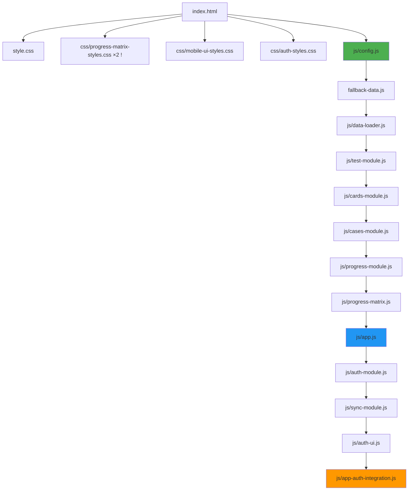
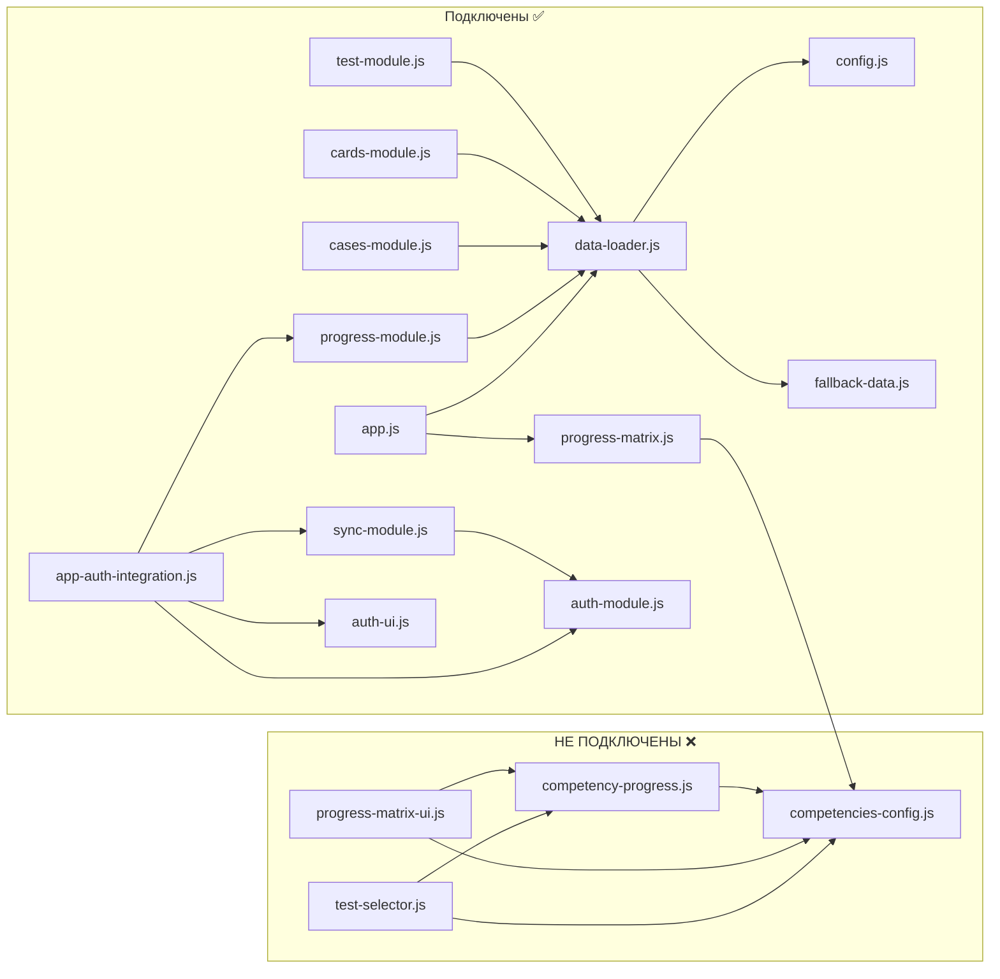
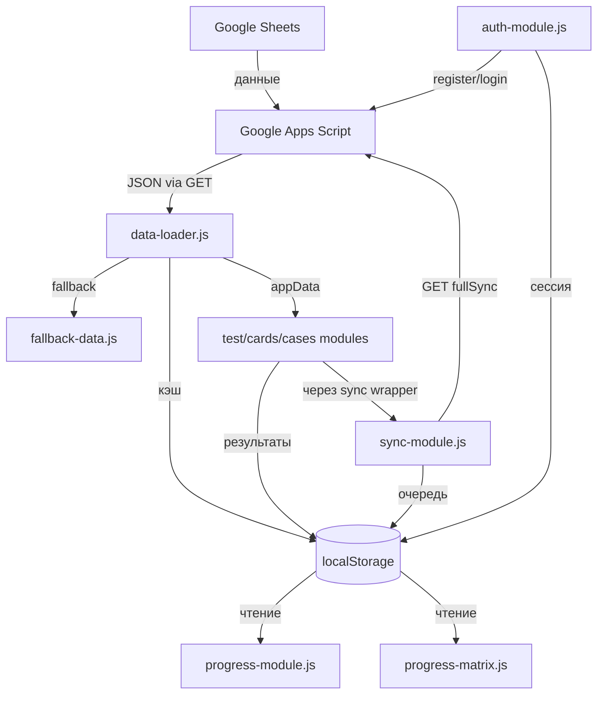

# CODEBASE_ANALYSIS.md

**Проект:** rus-pharma-web-app — Электронная рабочая тетрадь курса «Фармакология и лечение ран в боевых условиях в удалённых районах»
**Дата анализа:** 2026-02-07
**Версия приложения:** 2.0.0 (config.js:21)

---

## 1. FILE MAP

### Корневые файлы

| Файл | Строки | Байты | Назначение |
|-------|--------|-------|-----------|
| `index.html` | 388 | ~15 KB | Единственная HTML-страница (SPA). Содержит разметку всех секций: меню, тесты, карточки, кейсы, прогресс |
| `style.css` | 1536 | 28 604 | Основные стили приложения. Header, навигация, карточки, тесты, модальные окна |
| `manifest.json` | 21 | ~500 | PWA-манифест. Имя, иконки, ориентация, цвета |
| `sw.js` | 0 | 0 | **ПУСТОЙ ФАЙЛ.** Service Worker не реализован |
| `fallback-data.js` | 72 | ~2 KB | Резервные данные: 1 вопрос, 1 препарат, 1 сценарий. Заглушки |
| `icon-192.png` | — | 40 561 | PWA-иконка 192x192 |
| `LICENSE` | — | — | MIT License |
| `README.md` | — | — | Описание проекта |

### CSS файлы

| Файл | Строки | Назначение |
|-------|--------|-----------|
| `css/auth-styles.css` | 477 | Стили экрана авторизации. Полноэкранный оверлей, формы входа/регистрации, адаптивность (480px, 360px, landscape) |
| `css/progress-matrix-styles.css` | 610 | Стили матрицы компетенций, графиков, рекомендаций |
| `css/mobile-ui-styles.css` | 379 | Мобильная адаптация UI-элементов |

### JS файлы

---

#### `js/config.js` — 25 строк

**Назначение:** Центральная конфигурация приложения.

**Глобальные переменные (создаёт):**
- `CONFIG` (объект)

**Ключевые значения:**
```
CONFIG.API_URL        — URL Google Apps Script (строка 7)
CONFIG.SYNC_INTERVAL  — 300000 мс / 5 мин (строка 10)
CONFIG.CACHE_KEY      — 'pharmacology_data' (строка 13)
CONFIG.CACHE_EXPIRY   — 3600000 мс / 1 час (строка 14)
CONFIG.INITIAL_PATIENT_HEALTH — 100 (строка 17)
CONFIG.CRITICAL_HEALTH — 30 (строка 18)
CONFIG.VERSION        — '2.0.0' (строка 21)
```

**Зависимости:** Нет.

---

#### `js/data-loader.js` — 117 строк

**Назначение:** Загрузка данных из Google Apps Script API, кэширование в localStorage, откат на fallback.

**Глобальные переменные (создаёт):**
- `appData` (объект: `{ questions, drugs, scenarios, settings }`) — строка 5

**Глобальные функции (создаёт):**
- `loadData()` — строка 13. Основная точка загрузки
- `fetchFreshData()` — строка 46. GET `${CONFIG.API_URL}?action=getAll`
- `saveToCache(data)` — строка 63. Пишет в `localStorage[CONFIG.CACHE_KEY]`
- `loadFromCache()` — строка 71. Читает из `localStorage[CONFIG.CACHE_KEY]`, проверяет TTL
- `loadFallbackData()` — строка 86. Использует `FALLBACK_QUESTIONS`, `FALLBACK_DRUGS`, `FALLBACK_SCENARIOS`
- `showLoading(show)` — строка 96
- `updateSyncStatus(status)` — строка 100
- `syncData()` — строка 105. Ручная синхронизация (очищает кэш и перезагружает)
- `initModules()` — строка 112. Вызывает `initTestModule()`, `initCardsModule()`, `initCasesModule()`, `updateProgress()`

**Зависимости:** `CONFIG` (config.js), `FALLBACK_*` (fallback-data.js), DOM-элементы `#loading`, `#syncStatus`, `#lastUpdate`

**localStorage ключи:** `pharmacology_data` (строки 68, 72, 106)

---

#### `js/app.js` — 104 строки

**Назначение:** Главный контроллер — навигация между секциями, утилита конвертации Google Drive URL.

**Глобальные функции (создаёт):**
- `showSection(sectionId)` — строка 12. Переключение вкладок, рендер матрицы при переходе на `progress`
- `zoomImage()` — строка 64. Зум картинки вопроса
- `convertGoogleDriveUrl(url)` — строка 81. Конвертация Google Drive URL → `lh3.googleusercontent.com/d/{id}` (строка 100)

**Точка входа:** `DOMContentLoaded` → `loadData()` + `showSection('menu')` (строки 3-9)

**Зависимости:** `loadData()` (data-loader.js), `ProgressMatrix` (progress-matrix.js), `updateProgress()` (progress-module.js), `openImageModal()` (ТРЕБУЕТ УТОЧНЕНИЯ — определение не найдено в коде)

---

#### `js/test-module.js` — 612 строк

**Назначение:** Движок тестирования. Рендеринг вопросов, проверка ответов, подсчёт баллов.

**Глобальные функции (создаёт):**
- `initTestModule()` — инициализация
- `startNewTest()` — начало нового теста
- `checkTestAnswer()` — проверка ответа
- `nextTestQuestion()` — следующий вопрос
- `window.startTest` — строка 611

**Глобальные переменные (создаёт):**
- `window.startTest` (строка 611)

**Зависимости:** `appData.questions` (data-loader.js), `convertGoogleDriveUrl()` (app.js)

**localStorage ключи:** `testResults` (строки 392, 401), `progressMatrix` (строки 517, 582)

---

#### `js/cards-module.js` — 451 строка

**Назначение:** Флеш-карточки препаратов. Перелистывание, «Знаю»/«Повторить», фильтрация, два режима просмотра.

**Глобальные функции (создаёт):**
- `initCardsModule()` — инициализация
- `showCard(index)` — показать карточку
- `flipCard()` — перевернуть
- `nextCard()` / `prevCard()` — навигация
- `markCard(status)` — пометить know/dontknow
- `filterCards()` — фильтрация по категории
- `setCardView(mode)` — переключение single/grid

**Зависимости:** `appData.drugs` (data-loader.js), `convertGoogleDriveUrl()` (app.js)

**localStorage ключи:** `cardResults` (строки 257, 364, 375, 434)

---

#### `js/cases-module.js` — 458 строк

**Назначение:** Клинические сценарии (RPG-кейсы). Многошаговые ветвящиеся решения, здоровье пациента.

**Глобальные функции (создаёт):**
- `initCasesModule()` — инициализация
- `startScenario(index)` — начать сценарий
- `makeChoice(choiceIndex)` — выбрать действие
- `exitScenario()` — выйти
- `restartScenario()` — перезапустить

**Зависимости:** `appData.scenarios` (data-loader.js), `convertGoogleDriveUrl()` (app.js), `CONFIG.INITIAL_PATIENT_HEALTH` (config.js)

**localStorage ключи:** `caseResults` (строки 455, 457)

---

#### `js/progress-module.js` — 109 строк

**Назначение:** Простая агрегация статистики: дни обучения, средний балл, достижения.

**Глобальные функции (создаёт):**
- `updateProgress()` — строка 2. Обновление всех виджетов прогресса
- `calculateOverallProgress()` — строка 46
- `updateAchievements()` — строка 59. Простая система: 3 фиксированных достижения
- `updateCategoryProgress()` — строка 77. Прогресс по 4 категориям

**Зависимости:** `appData.drugs` (data-loader.js)

**localStorage ключи:** `startDate` (строки 4, 6), `testResults` (строки 14, 47, 61), `cardResults` (строки 48, 62, 82)

---

#### `js/progress-matrix.js` — 395 строк

**Назначение:** Матрица прогресса по компетенциям (расчёт данных).

**Глобальные переменные (создаёт):**
- `window.ProgressMatrix` — строка 394

**Публичный API:**
- `ProgressMatrix.render(container)` — рендер матрицы в DOM-контейнер
- `ProgressMatrix.getCompetencyData()` — получение данных

**Зависимости:** `COMPETENCIES_CONFIG`, `MODULE_TO_COMPETENCY` (competencies-config.js)

**localStorage ключи:** `progressMatrix` (строка 290)

---

#### `js/progress-matrix-ui.js` — 808 строк ⚠️ НЕ ПОДКЛЮЧЁН В index.html

**Назначение:** Расширенная визуализация: курс обучения, путь, матрица (столбцы/таблица), рекомендации, достижения, напоминания, SVG-графики.

**Модуль:** `ProgressMatrixUI` (IIFE)

**TODO в коде:**
- Строка 740: `// TODO: Реализовать модальное окно настроек`

**Зависимости:** `COMPETENCIES_CONFIG`, `COMPETENCY_BLOCKS`, `CadetProgress`

---

#### `js/competencies-config.js` — 328 строк ⚠️ НЕ ПОДКЛЮЧЁН В index.html

**Назначение:** Определение 26 компетенций, 6 блоков, маппинг модулей 1-20 → компетенции.

**Глобальные переменные (создаёт):**
- `COMPETENCIES_CONFIG` — 26 компетенций (строки 7-254)
- `COMPETENCY_BLOCKS` — 6 блоков (строки 257-294)
- `MODULE_TO_COMPETENCY` — маппинг модуль→компетенция (строки 297-318)
- `window.COMPETENCIES_CONFIG` (строка 325)
- `window.COMPETENCY_BLOCKS` (строка 326)
- `window.MODULE_TO_COMPETENCY` (строка 327)

**Зависимости:** Нет.

**Проблема:** В `COMPETENCY_BLOCKS.PHARMACOLOGY.competencies` (строка 268) указан `'SPASMOLYTICS'`, но в `COMPETENCIES_CONFIG` ключ — `'SPASMOLITICA'` (строка 129). **Несоответствие ключей.**

---

#### `js/competency-progress.js` — 952 строки ⚠️ НЕ ПОДКЛЮЧЁН В index.html

**Назначение:** Полноценное управление профилем курсанта: прогресс по компетенциям, история тестов, достижения, streaks, рекомендации, экспорт.

**Модуль:** `CadetProgress` (IIFE)

**Публичный API:**
- `CadetProgress.createProfile(data)` — создание профиля
- `CadetProgress.loadProfile()` — загрузка из localStorage
- `CadetProgress.saveProfile()` — сохранение
- `CadetProgress.recordTestResult(type, competencyId, score, total)` — запись результата
- `CadetProgress.getCompetencyMatrix()` — матрица компетенций
- `CadetProgress.getRecommendations()` — генерация рекомендаций
- `CadetProgress.checkAchievements()` — проверка достижений
- `CadetProgress.exportToJSON()` / `exportToCSV()` — экспорт

**Зависимости:** `COMPETENCIES_CONFIG`, `COMPETENCY_BLOCKS`, `MODULE_TO_COMPETENCY`

---

#### `js/test-selector.js` — 962 строки ⚠️ НЕ ПОДКЛЮЧЁН В index.html

**Назначение:** Экран выбора типа теста, прохождение теста с таймером, результаты с разбивкой по компетенциям.

**Модуль:** `TestSelector` (IIFE)

**TODO в коде:**
- Строка 901: `// TODO: Реализовать просмотр детальных ответов`
- Строка 932: `// TODO: Реализовать генерацию сертификата`

**Зависимости:** `COMPETENCIES_CONFIG`, `MODULE_TO_COMPETENCY`, `CadetProgress`, `appData`

---

#### `js/auth-module.js` — 419 строк

**Назначение:** Авторизация курсантов. Регистрация, вход по ID+PIN, офлайн-вход, автологин.

**Модуль:** `AuthModule` (IIFE)

**Публичный API:**
- `AuthModule.init(callbacks)` — инициализация + автологин
- `AuthModule.checkGroup(code)` — проверка группы (GET `?action=getGroup&code=...`)
- `AuthModule.register(groupCode, fullName)` — регистрация (GET `?action=register&...`)
- `AuthModule.login(cadetId, pinCode)` — вход (GET `?action=login&...`)
- `AuthModule.logout(clearAll)` — выход
- `AuthModule.isLoggedIn()` — проверка сессии
- `AuthModule.getCurrentCadet()` — текущий курсант
- `AuthModule.isOnline()` — состояние сети

**Внутренние функции:**
- `hashPin(pin)` — строка 312. Простой хеш: `djb2` с солью `'salt_med_app_2025'`
- `fetchWithTimeout(url)` — строка 326. Fetch с AbortController, таймаут 10с
- `offlineLogin(cadetId, pinCode)` — строка 243. Сравнение хешей в localStorage

**localStorage ключи:**
- `auth_cadet_id` (строка 19)
- `auth_cadet_data` (строка 20)
- `auth_pin_hash` (строка 21)
- `auth_last_sync` (строка 22)
- `auth_offline_mode` (строка 23)

**Зависимости:** `SyncModule` (sync-module.js) — вызывает `SyncModule.syncNow()` при восстановлении сети (строка 352)

---

#### `js/auth-ui.js` — 508 строк

**Назначение:** UI авторизации. Формы входа/регистрации, валидация, спиннеры, экран успеха.

**Модуль:** `AuthUI` (IIFE)

**Публичный API:**
- `AuthUI.show()` — показать экран авторизации
- `AuthUI.hide()` — скрыть

**Зависимости:** `AuthModule` (auth-module.js), `window.onAuthSuccess` (app-auth-integration.js)

---

#### `js/app-auth-integration.js` — 330 строк

**Назначение:** Связующий модуль. Оркестрирует Auth → App init, оборачивает save-функции для синхронизации.

**Модуль:** IIFE (немедленно выполняется)

**Глобальные переменные (создаёт):**
- `window.onAuthSuccess` (строка 53) — колбэк успешной авторизации
- `window.saveTestResultWithSync` (строка 263) — обёртка сохранения тестов
- `window.saveCardResultWithSync` (строка 278) — обёртка сохранения карточек
- `window.AppAuth` (строка 317) — объект для отладки

**Внутренний CONFIG (строка 16-25):**
```
API_URL: (Google Apps Script URL) — дублирует config.js
REQUIRE_AUTH: true
AUTO_SYNC: true
```

**Точка входа:** `DOMContentLoaded` (строка 31) — инициализирует AuthModule, показывает AuthUI при необходимости

**Зависимости:** `AuthModule`, `AuthUI`, `SyncModule`, `ProgressMatrix`, `updateProgress()`

**⚠️ КОНФЛИКТ:** Этот файл регистрирует свой обработчик `DOMContentLoaded` (строка 31), а `app.js` — свой (строка 3). Оба вызываются, но порядок зависит от загрузки скриптов.

---

#### `js/sync-module.js` — 501 строка

**Назначение:** Очередь синхронизации данных с облаком. Пакетная отправка, автосинхронизация, обработка конфликтов.

**Модуль:** `SyncModule` (IIFE)

**Публичный API:**
- `SyncModule.init(callbacks)` — инициализация
- `SyncModule.addToQueue(type, key, value)` — добавить в очередь
- `SyncModule.saveTestResult(...)` — хелпер
- `SyncModule.saveCardResult(...)` — хелпер
- `SyncModule.saveProgressMatrix(...)` — хелпер
- `SyncModule.saveAchievement(...)` — хелпер
- `SyncModule.syncNow()` — GET `${API_URL}?action=fullSync&cadetId=...&localProgress=...&lastSyncTime=...`
- `SyncModule.getStatus()` — статус синхронизации

**localStorage ключи:**
- `sync_queue` (строка 16)
- `sync_last_time` (строка 17)
- `sync_device_id` (строка 18)
- `testResults` (строки 311, 322)
- `cardResults` (строки 330, 343)
- `progressMatrix` (строки 350, 355)
- `unlockedAchievements` (строки 362, 366)

**Зависимости:** `AuthModule` (auth-module.js) — проверяет `isLoggedIn()`, `isOnline()`, `getCurrentCadet()`

**⚠️ Дублирование:** API URL захардкожен повторно в `getApiUrl()` (строка 447), хотя уже есть в config.js

---

## 2. ARCHITECTURE DIAGRAM

### 2.1 Порядок загрузки скриптов (из index.html, строки 365-378)



### 2.2 Зависимости между модулями



### 2.3 Поток данных



---

## 3. DATA FLOW

### 3.1 Источники данных

| Источник | Описание | Используется в |
|----------|----------|---------------|
| Google Apps Script API | `?action=getAll` — все данные (вопросы, препараты, сценарии) | data-loader.js:49 |
| Google Apps Script API | `?action=getGroup&code=...` — проверка группы | auth-module.js:116 |
| Google Apps Script API | `?action=register&...` — регистрация | auth-module.js:148 |
| Google Apps Script API | `?action=login&...` — вход | auth-module.js:190 |
| Google Apps Script API | `?action=quickLogin&...` — автологин | auth-module.js:218 |
| Google Apps Script API | `?action=fullSync&...` — синхронизация | sync-module.js:215 |
| fallback-data.js | 1 вопрос + 1 препарат + 1 сценарий (заглушки) | data-loader.js:86 |

**Единый API URL (4 места дублирования):**
```
https://script.google.com/macros/s/AKfycbwB0oYN70vH9sMnQItBL1rSVuVxF2t90Fx5A_9wWZjR3lrfSNPcmDVZuqOC7mfsO87x/exec
```
- `js/config.js:7`
- `js/auth-module.js:15`
- `js/app-auth-integration.js:18`
- `js/sync-module.js:447`

### 3.2 localStorage — полная карта ключей

| Ключ | Формат | Записывается в | Читается в |
|------|--------|---------------|------------|
| `pharmacology_data` | `{ data: {...}, timestamp: number }` | data-loader.js:68 | data-loader.js:72 |
| `testResults` | `[{ testType, competencyId, score, timestamp }]` | test-module.js:401, sync-module.js:322 | test-module.js:392, progress-module.js:14,47,61, sync-module.js:311 |
| `cardResults` | `[{ drugId, status, timestamp }]` | cards-module.js:375, sync-module.js:343 | cards-module.js:257,364,434, progress-module.js:48,62,82, sync-module.js:330 |
| `progressMatrix` | `{ [competencyId]: { scores... } }` | test-module.js:582, sync-module.js:355 | test-module.js:517, progress-matrix.js:290, sync-module.js:350 |
| `caseResults` | `[{ scenarioId, result, timestamp }]` | cases-module.js:457 | cases-module.js:455 |
| `startDate` | ISO date string | progress-module.js:6 | progress-module.js:4 |
| `unlockedAchievements` | `[achievementId, ...]` | sync-module.js:366 | sync-module.js:362 |
| `auth_cadet_id` | string (ID курсанта) | auth-module.js:302 | auth-module.js:67,244 |
| `auth_cadet_data` | `{ id, fullName, groupCode, groupName }` | auth-module.js:303,225 | auth-module.js:74,246 |
| `auth_pin_hash` | string (djb2 хеш) | auth-module.js:305 | auth-module.js:245 |
| `auth_last_sync` | string | auth-module.js:22 | — |
| `auth_offline_mode` | `'true'` | auth-module.js:93,250,362 | auth-module.js:378 |
| `sync_queue` | `[{ id, dataType, dataKey, dataValue, timestamp, deviceId, synced }]` | sync-module.js:413 | sync-module.js:405 |
| `sync_last_time` | string | sync-module.js:443 | sync-module.js:439 |
| `sync_device_id` | string | sync-module.js:430 | sync-module.js:435 |

### 3.3 Как данные отображаются

| Модуль | Секция UI | Контейнер DOM |
|--------|----------|--------------|
| test-module.js | `#test` | `#questionText`, `#answersContainer`, `#questionImage` |
| cards-module.js | `#cards` | `#flashcard`, `#singleCardView`, `#gridCardView` |
| cases-module.js | `#cases` | `#scenariosGrid`, `#activeScenario`, `#scenarioResult` |
| progress-module.js | `#progress` | `#studyDays`, `#testsComplete`, `#avgScore`, `#bestScore`, `#achievements` |
| progress-matrix.js | `#progress` | `#competency-matrix-container` |

---

## 4. CURRENT STATE (честная оценка)

### Что работает ✅

1. **Загрузка данных из Google Sheets API** — data-loader.js корректно обрабатывает кэш, сеть, fallback
2. **Модуль тестирования** (test-module.js) — полноценный движок: вопросы с картинками, проверка ответов, пояснения
3. **Модуль флеш-карточек** (cards-module.js) — два режима просмотра, фильтрация, know/dontknow
4. **Модуль клинических кейсов** (cases-module.js) — RPG-стиль, здоровье пациента, ветвящиеся решения
5. **Простая статистика** (progress-module.js) — дни обучения, средний балл, 3 базовых достижения
6. **Авторизация** (auth-module.js + auth-ui.js) — регистрация, вход по PIN, офлайн-вход, автологин
7. **Синхронизация** (sync-module.js) — очередь, автосинхронизация, обработка конфликтов
8. **Google Drive URL конвертация** (app.js) — обход хотлинкинг-защиты через lh3.googleusercontent.com
9. **Навигация** (app.js) — SPA-переключение 5 секций
10. **Адаптивные стили** — мобильная версия, ландшафт

### Что сломано или не подключено ❌

1. **4 файла НЕ подключены в index.html:**
   - `js/competencies-config.js` — определения компетенций (от него зависят progress-matrix.js, competency-progress.js, test-selector.js, progress-matrix-ui.js)
   - `js/competency-progress.js` — расширенный прогресс курсанта
   - `js/progress-matrix-ui.js` — расширенная визуализация
   - `js/test-selector.js` — экран выбора тестов с таймером

2. **Service Worker пуст** — `sw.js` = 0 байт. PWA-офлайн не работает.

3. **PWA-иконка icon-512.png отсутствует** — manifest.json ссылается на неё (строка 17-20), но файла нет.

4. **progress-matrix-styles.css подключён дважды** — index.html строки 8 и 12.

5. **Несоответствие ключа компетенции** — `COMPETENCY_BLOCKS.PHARMACOLOGY` ссылается на `'SPASMOLYTICS'` (competencies-config.js:268), но ключ в `COMPETENCIES_CONFIG` = `'SPASMOLITICA'` (строка 129).

6. **Функция `openImageModal()` вызывается но не определена** — app.js:68 вызывает `openImageModal(img.src)`, но определение не найдено ни в одном подключённом файле.

7. **Два конкурирующих обработчика DOMContentLoaded** — app.js:3 и app-auth-integration.js:31. Оба вызывают `loadData()` / инициализацию.

### Хардкод в коде

| Файл | Строка | Что захардкожено |
|------|--------|-----------------|
| config.js | 7 | API URL Google Apps Script |
| auth-module.js | 15 | API URL (дублирование) |
| auth-module.js | 314 | Соль хеша PIN: `'salt_med_app_2025'` |
| app-auth-integration.js | 18 | API URL (дублирование) |
| sync-module.js | 447 | API URL (дублирование) |
| fallback-data.js | 4-5 | URL placehold.co |
| progress-module.js | 81 | Категории: `['Антибиотики', 'Анальгетики', 'Антидоты', 'Экстренные']` |
| progress-module.js | 53 | Магическое число: `/20` — предполагает 20 тестов |

### TODO в коде

| Файл | Строка | TODO |
|------|--------|------|
| test-selector.js | 901 | `// TODO: Реализовать просмотр детальных ответов` |
| test-selector.js | 932 | `// TODO: Реализовать генерацию сертификата` |
| progress-matrix-ui.js | 740 | `// TODO: Реализовать модальное окно настроек` |

### Несоответствия между README и кодом

- README описывает проект как «интерактивную рабочую тетрадь» с полной функциональностью, но 4 ключевых модуля (компетенции, расширенный прогресс, выбор тестов, расширенная визуализация) не подключены.
- Manifest.json описывает `"start_url": "/index.html"` — путь с `/` может не работать при хостинге не в корне домена.

---

## 5. API CONTRACT

**Единый базовый URL:**
```
https://script.google.com/macros/s/AKfycbwB0oYN70vH9sMnQItBL1rSVuVxF2t90Fx5A_9wWZjR3lrfSNPcmDVZuqOC7mfsO87x/exec
```

**Метод:** Все запросы через GET (для обхода CORS с Google Apps Script)

### Эндпоинты

#### `?action=getAll`

**Файл:** data-loader.js:49
**Назначение:** Получить все данные приложения

**Ответ (ожидаемый формат):**
```json
{
    "questions": [
        { "id": "q1", "category": "...", "type": "...", "question": "...",
          "imageUrl": "...", "answers": ["...", "..."], "correct": 0, "explanation": "..." }
    ],
    "drugs": [
        { "id": "d1", "name": "...", "category": "...", "inn": "...", "form": "...",
          "imageUrl": "...", "dosage": "...", "indications": "...",
          "contraindications": "...", "sideEffects": "...", "fieldNotes": "..." }
    ],
    "scenarios": [
        { "id": "CASE_001", "nodes": { "START": { "id": "START", "title": "...",
          "description": "...", "imageUrl": "...", "type": "start|decision|win|lose",
          "patientState": "...", "choices": [{ "text": "...", "nextNode": "..." }] } } }
    ],
    "settings": {}
}
```

**При ошибке:** `{ "error": "..." }`

---

#### `?action=getGroup&code={groupCode}`

**Файл:** auth-module.js:116
**Назначение:** Проверить существование группы

**Параметры:**
- `code` — код группы (переводится в uppercase)

**Ответ (ожидаемый):**
```json
{ "success": true, "groupName": "...", "groupCode": "..." }
```

---

#### `?action=register&groupCode={code}&fullName={name}`

**Файл:** auth-module.js:148
**Назначение:** Зарегистрировать нового курсанта

**Параметры:**
- `groupCode` — код группы (uppercase)
- `fullName` — ФИО курсанта (trim)

**Ответ (ожидаемый):**
```json
{
    "success": true,
    "cadetId": "...",
    "fullName": "...",
    "groupCode": "...",
    "groupName": "...",
    "pinCode": "1234"
}
```

---

#### `?action=login&cadetId={id}&pinCode={pin}`

**Файл:** auth-module.js:190
**Назначение:** Вход по ID и PIN

**Параметры:**
- `cadetId` — ID курсанта (uppercase)
- `pinCode` — 4-значный PIN

**Ответ (ожидаемый):**
```json
{
    "success": true,
    "cadet": { "id": "...", "fullName": "...", "groupCode": "...", "groupName": "..." }
}
```

---

#### `?action=quickLogin&cadetId={id}`

**Файл:** auth-module.js:218
**Назначение:** Быстрый вход (автологин, без PIN)

**Параметры:**
- `cadetId` — ID курсанта

**Ответ (ожидаемый):**
```json
{
    "success": true,
    "cadet": { "id": "...", "fullName": "...", "groupCode": "...", "groupName": "..." }
}
```

---

#### `?action=fullSync&cadetId={id}&localProgress={json}&lastSyncTime={time}`

**Файл:** sync-module.js:208-215
**Назначение:** Двусторонняя синхронизация прогресса

**Параметры:**
- `cadetId` — ID курсанта
- `localProgress` — JSON-строка массива элементов очереди
- `lastSyncTime` — время последней синхронизации (ISO string или пустая строка)

**⚠️ ПРОБЛЕМА:** Весь `localProgress` передаётся через query string (GET). При большом объёме данных URL может превысить лимит (обычно 2000-8000 символов).

**Ответ (ожидаемый):**
```json
{
    "success": true,
    "saved": 5,
    "loaded": 3,
    "syncTime": "2026-02-07T12:00:00Z",
    "serverProgress": [
        { "dataType": "TEST_RESULT", "dataKey": "...", "dataValue": "..." }
    ]
}
```

---

## 6. CRITICAL ISSUES

### 🔴 Блокеры запуска

**1. Четыре JS-файла не подключены в index.html**

`index.html` не содержит `<script>` тегов для:
- `js/competencies-config.js`
- `js/competency-progress.js`
- `js/progress-matrix-ui.js`
- `js/test-selector.js`

Это означает, что **система компетенций, расширенный прогресс, выбор тестов и расширенная визуализация полностью неработоспособны**. Модуль `progress-matrix.js` (который подключён) зависит от `COMPETENCIES_CONFIG` и `MODULE_TO_COMPETENCY`, которые определены в неподключённом `competencies-config.js` — он будет падать с `ReferenceError`.

**Исправление:** Добавить `<script>` теги в `index.html` перед зависящими модулями:
```html
<script src="js/competencies-config.js"></script>  <!-- до progress-matrix.js -->
<script src="js/competency-progress.js"></script>   <!-- до test-selector.js -->
<script src="js/test-selector.js"></script>          <!-- до app.js -->
<script src="js/progress-matrix-ui.js"></script>     <!-- до app.js -->
```

---

**2. Service Worker пуст (sw.js = 0 байт)**

`manifest.json` объявляет PWA, но `sw.js` пустой. Офлайн-режим на уровне Service Worker не работает. Приложение полагается только на localStorage-кэш.

---

**3. Несоответствие ключа компетенции: SPASMOLYTICS vs SPASMOLITICA**

`competencies-config.js:268` — блок PHARMACOLOGY ссылается на `'SPASMOLYTICS'`, но такого ключа нет в `COMPETENCIES_CONFIG`. Правильный ключ — `'SPASMOLITICA'` (строка 129). Это приведёт к `undefined` при обращении к этой компетенции.

---

### 🟡 Важные недоработки

**4. API URL дублируется в 4 местах**

Один и тот же URL захардкожен в config.js:7, auth-module.js:15, app-auth-integration.js:18, sync-module.js:447. При смене URL нужно менять в 4 файлах.

**5. Два конкурирующих обработчика DOMContentLoaded**

`app.js:3` вызывает `loadData()` и `showSection('menu')`. `app-auth-integration.js:31` инициализирует авторизацию и вызывает `initApp()`. Оба срабатывают, потенциально вызывая двойную загрузку данных и гонку состояний.

**6. Синхронизация через GET query string**

`sync-module.js:215` — весь `localProgress` (JSON) передаётся в URL. При накоплении данных URL может превысить лимит. Документировано в коде как «GET вместо POST для обхода CORS».

**7. Отсутствует icon-512.png**

`manifest.json:17-20` ссылается на `icon-512.png`, но файл не существует. Chrome DevTools покажет ошибку при установке PWA.

**8. CSS подключён дважды**

`index.html:8` и `index.html:12` — `css/progress-matrix-styles.css` загружается дважды.

**9. Функция openImageModal() не определена**

`app.js:68` вызывает `openImageModal(img.src)`, но эта функция не определена ни в одном подключённом JS-файле. Клик на `🔍` в тесте вызовет `ReferenceError`.

**10. fallback-data.js содержит минимальные заглушки**

Только 1 вопрос, 1 препарат, 1 сценарий. В офлайн-режиме без кэша приложение будет практически бесполезно.

---

### 🟢 Улучшения

**11. Хеш PIN — слабый алгоритм**

`auth-module.js:312-321` — используется `djb2` с фиксированной солью `'salt_med_app_2025'`. Для учебного приложения приемлемо, но при наличии доступа к localStorage PIN можно подобрать перебором (10000 комбинаций).

**12. Нет автоматических тестов**

Ни одного unit-теста или e2e-теста. При рефакторинге нет защиты от регрессий.

**13. IIFE-модули без сборки**

Все модули используют IIFE-паттерн и глобальную область. Переход на ES-модули (`import`/`export`) + бандлер (Vite) улучшит управляемость зависимостей.

**14. Нет линтинга (ESLint)**

Нет конфигурации линтера. Стиль кода не enforced.

**15. Категории в progress-module.js захардкожены**

`progress-module.js:81` — `['Антибиотики', 'Анальгетики', 'Антидоты', 'Экстренные']`. Категории должны извлекаться из данных или конфигурации.

**16. Конвертация Google Drive URL дублируется**

`convertGoogleDriveUrl()` определена в `app.js:81-104`, аналогичная логика есть в `test-selector.js:883`. Стоит вынести в общую утилиту.

---

## Приложение: Сводная таблица глобальных объектов

| Имя | Тип | Файл | Подключён |
|-----|-----|------|-----------|
| `CONFIG` | const object | config.js:5 | ✅ |
| `CONFIG` (локальный) | const object | auth-module.js:13, sync-module.js:13, app-auth-integration.js:16 | ✅ (внутри IIFE) |
| `appData` | let object | data-loader.js:5 | ✅ |
| `FALLBACK_QUESTIONS` | const array | fallback-data.js:7 | ✅ |
| `FALLBACK_DRUGS` | const array | fallback-data.js:20 | ✅ |
| `FALLBACK_SCENARIOS` | const array | fallback-data.js:36 | ✅ |
| `PLACEHOLDER_IMG` | const string | fallback-data.js:4 | ✅ |
| `ADRENALINE_IMG` | const string | fallback-data.js:5 | ✅ |
| `AuthModule` | const object (IIFE) | auth-module.js:6 | ✅ |
| `AuthUI` | const object (IIFE) | auth-ui.js | ✅ |
| `SyncModule` | const object (IIFE) | sync-module.js:6 | ✅ |
| `window.ProgressMatrix` | object | progress-matrix.js:394 | ✅ |
| `window.startTest` | function | test-module.js:611 | ✅ |
| `window.onAuthSuccess` | function | app-auth-integration.js:53 | ✅ |
| `window.saveTestResultWithSync` | function | app-auth-integration.js:263 | ✅ |
| `window.saveCardResultWithSync` | function | app-auth-integration.js:278 | ✅ |
| `window.AppAuth` | object | app-auth-integration.js:317 | ✅ |
| `COMPETENCIES_CONFIG` | const object | competencies-config.js:7 | ❌ |
| `COMPETENCY_BLOCKS` | const object | competencies-config.js:257 | ❌ |
| `MODULE_TO_COMPETENCY` | const object | competencies-config.js:297 | ❌ |
| `CadetProgress` | const object (IIFE) | competency-progress.js | ❌ |
| `TestSelector` | const object (IIFE) | test-selector.js | ❌ |
| `ProgressMatrixUI` | const object (IIFE) | progress-matrix-ui.js | ❌ |
